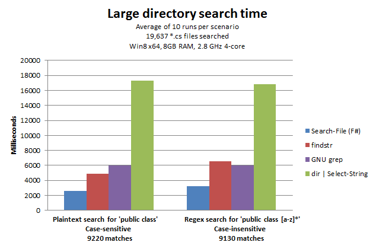
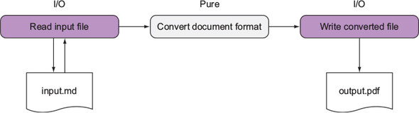

- title: Functional Programming 101
- description: Introduction to Functional Programming and Why You Should Use It
- author: Ryan Dowd
- theme: night
- transition: default

***

# Functional Programming 101

Presented by: Ryan Dowd

***

## About

This presentation is built with [FsReveal](https://fsprojects.github.io/FsReveal/index.html).
FsReveal is an F# frontend for [Reveal.js](https://github.com/hakimel/reveal.js).

Navigating these waters:

- `Spacebar`, `l`, or `n` to go forward
- `h` or `p` to go backward
- `Esc` to see an overview of all slides

***

## Overview

- Who am I?
- Who is this talk for?
- Why should I care about functional programming?
- What is Functional Programming?
- Core Functional Concepts
  - Immutability
  - First-class functions
  - Higher-order functions
  - Recursion
- But what about...?

***

## Introduction

I am Ryan

<!--
    Instead of trying to physically transform the photo,
    just use css to quickly scale the image
-->


' BS EE USMA 2009
' Started Crane in 2013 with WXQS
' Currently WXQT
' Deployed with MTRC 3 times

***

## Target Audience

- Anyone who codes... anything
- Anyone involved in data science or analysis
- Anyone using or developing machine learning techniques/algorithms

***

## What is Functional Programming?

Functional programming is a declaritive programming paradigm.
It focuses on designing programs as an evaluation of mathmatical functions.
This focus drives the style away from state mutations and mutable data.

---

### Wait... what!?

- Functions are passed around like variables
- You don't change variables

***

## Why do I care?

Do you work with lots of data?
Do you work with lots of processors?
Do you want to take advance of all those processors to crunch that data _easily_?

Of course you do!

---



_Search-File:
an FSharp cmdlt, optimized for parallel processing,
running in PowerShell_

' Atkinson, "Rethinking findstr with F# and PowerShell".
' PowerShell is intrepreted at runtime, to boot.
' The "dir | Select-String" command is also PowerShell; see the difference?

***

## What is a Coding Paradigm?

Simply, the style of how code is written and structured.
These paradigms broadly define the features of a programming language.

The two most common paradigms are _imperative_ and _declarative_.

---

## Imperative Paradigm

This structure will instruct a program how to change its state.
Procedural programming and object-oriented programming are common imperative styles.
A classic example of an imperative language is C.

The essence of imperative programming is the _execution of statements_.

' What is an imperative language? A short list:
' Java, ECMAScript or JavaScript, and PHP
' Ada,
' Python/Ruby,
' and any assembly language.

## Declarative Paradigm

This structure declares the desired result as a series of expressions.
Functional programming is a common declarative style.
A classic example of a declarative language is Lisp.

The essence of declarative programming is the _evaluation of expressions_.

' An even shorter list of examples:
' SQL,
' Haskell,
' Scheme and Clojure),
' ML/SML/OCaml/F#.

---

## _Execution of Statements_ vs. _Evaluation of Expression_

This is a little abstract.
Let's clear that up by making some coffee, shall we?


We'll make some coffee using the two different paradigms.
Our design goal is to make a cup of coffee with two scoops of sugar.

---

' Most of us drink it, so I thought it'd be a relatable example.
' Example borrowed from Petricek, _Real World Functional Programming_, 5.
' Another way to think of this is functional is data-centric
' Imperative is behavior-centric

## Object-Oriented Coffee

We start with a single black coffee by executing a statement.
The constructed object can be modified, so we can change it by adding two sugars.
However, without additional guards, we may miss the goal with incorrect statements.

``` csharp
var cuppa = new Coffee(CoffeeType.Black);

// Can execute cuppa.Drink() now
// If executed, the following statement will execute on an empty cup
// Without more complex defensive coding, we could miss the design goal!

cuppa.AddSugar(2);
```

' Have to assume Coffee class exist!

---

## Functional Coffee

Here, we start with a single black coffee with 2 sugars by evaluating an expression.
We cannot modify or drink the cup before the sugar is added.
When we get the cup, it already contains the sugar!

``` fsharp
let makeCoffee coffeeStyle sugars =    // this is a function describing our goal
    { coffee with
        Style = coffeeStyle
        Sugar = sugars }

let cuppa = makeCoffee Black 2         // The evaluation
```

' Have to assume Coffee type exists!

---

## One last example...

``` csharp
// Imperative
bool myInt;
if (x < 10)
{
    myInt = true;
}
else
{
    myInt = false;
}

// Declarative
var myInt = x < 10 ? true : false;
```

***

## What does Functional Programming get me?

Well, have you ever written or read code that is...

- Difficult to change or refactor due to hidden dependencies?
- Repeating patterns and boilerplate, e.g. visitor pattern
- Full of race conditions or confusing execution orders?
- Struggling to execute asynchronously or concurrently?
- Behaving differently in real-world than it does in unit tests?

Functional programming can _easily_ solve those common issues.

---

### How, exactly?

- Immutability prevents race conditions
- Logic vice executions enables parrallism
- Composible functions prevent spaghetti code

***

## Core Concepts

An more in-depth look at:

- Immutability
- Functions
- Higher-Order Functions
- Recursion

***

## Immutability

> Taking the vary out of variables

Variables are initialized into a static, unchanging value.
If a modification needs to occur, usually a shallow copy is made.
Modification is made to the copy.

---

### Mutable Example

``` csharp
int x = GetInitialValue();
x = x + ReadInt32();
x = x * ReadInt32();
WriteInt32(res);
```

---

### Immutable Mutable Example

Now, pretend the compiler won't let us overwrite an initalized value.

``` csharp
int x0 = GetInitialValue();
int x1 = x0 + ReadInt32();
int x2 = x1 * ReadInt32();
WriteInt32(x2);
```

---

## Benefits of Immutability

### Assurance

> In other words, testing's real purpose is to validate mutation —
and the more mutation you have,
the more testing is required to make sure you get it right.
If you isolate the places where changes occur by severely restricting mutation,
you create a much smaller space for errors to occur...  
> _Neal Ford, IBM_

---

## Benefits of Immutability

### Thread-Safety and Parallelism

> Immutable objects are automatically thread-safe and have no synchronization issues.
They can also never exist in unknown or undesirable state because of an exception...
[This is called] _failure atomicity_:
once an object or type is constructed,
success or failure is immediately resolved (usually at compile time).  
> _Neal Ford, IBM_

---

## Benefits of Immutability

### Idempotent code!

...whoa, chief, that's a big word!
Blame [Benjamin Pierce](https://en.wikipedia.org/wiki/Benjamin_Peirce),
an American mathmetician.
Around 1870, he coined the term to describe a function that is strictly repeatable.

Idempotent code means the same input will _always_ return the same output.

---

## How do we do it?

### Convention

In this approach, you don't do any extra work to _prevent_ mutation.
You just _avoid_ it --
just like how you probably avoid `goto`, bitwise operations, and pointers now!

The downside, of course, is mutation can find a way!

---


---

## How do we do it?

### Use a functional language!

``` fsharp
// F#
let a = 42  // immutable by default

// immutable types with sugary copying
type Engineer =
    { FirstName: string
      LastName: string }

let someEmployee = { FirstName = "Jane"; LastName = "Doe" }
let someOtherEmployee = { someEmployee with FirstName = "John" }
```

---

## How do we do it?

### "Structural Enforcement"

A term I've coined to describe using structural keywords/features to employ immutability.

- Java has `final`
- C\# has `readonly`, `sealed`, and `protected`
- Python\Ruby\Lua have a concept of `metaclasses` that work well (albeit verbose)
- Python also has the `@property` tag

' A huge downside: usually lots of boilerplate

---

## Structural Enforcement

### C# 6.0

``` csharp
public protected class Engineer
{
    public string FirstName { get; }
    public string LastName { get; }

    public Engineer(string f, string l)
    {
        FirstName = f;
        LastName = l;
    }
}

var someEmployee = new Engineer("Jane", "Doe");
var someOtherEmployee = new Engineer("John", "Doe");
// These new engineers cannot be changed!
```

' It is simple to implement the `with` sugar in the class,
' but that's a lesson for another day!

---

## Structural Enforcement

### Python 3.1

``` python
def immutable_meta(name, bases, dct):
    class Meta(type):
        def __init__(cls, name, bases, dct):
            type.__setattr__(cls,"attr",set(dct.keys()))
            type.__init__(cls, name, bases, dct)

        def __setattr__(cls, attr, value):
            if attr not in cls.attr:
                raise AttributeError ("Cannot assign attributes to this class")
            return type.__setattr__(cls, attr, value)
    return Meta(name, bases, dct)

class Engineer:
    __metaclass__ = immutable_meta
    name = "John Doe"  # Or however python works...
```

Dealing with metatables and metaclasses can be burdensome!

' I call it floorplatre hell!

---

As you can see from the structural examples,
some imperative languages don't make it easy to make objects immutable.
Dynamically-typed languages like Python are especially offensive.
We can't all be as cool as C\#.  
¯\\\_(ツ)_/¯

---

## Shadowing

To avoid floorplate hell...

``` lua
-- Lua
function read(x, key)
  return x[key]
end

function write(x, key, value)
  local newTable = table.unpack(x) -- a built-in, shallow copy
  newTable[key] = value

  -- the original value, x, is unchanged
  return newTable
end
```

' Shadowing aka copy-on-write.
' This is Lua.
' I chose it beause it looks like a psuedolanguage lol.
' Lua, incidentally,
' also uses floorplate hell to implement structural enforcement via metatables.
' A lot of modern functional languages actually do shadowing in the background!

***

## Functions

The ideas and patterns of functional programming are rooted in mathmatical functions,
especially [lambda calculus](https://en.wikipedia.org/wiki/Lambda_calculus).

``` math
f(x) = x + 1
```

Unlike procedural methods, functional functions have two properties:

- Always return the same output value for a given input value
- A function has no side effects (purity)

' Fun fact, hashtables and maps are functions!

---

## Purity and why it matters

If a function becomes pure and deterministic
then their logic is easy to abstract and reason about (testing and debugging is trivial),
and order of evaluation becomes unimportant (concurrency is trivial).
Therefore, purity allows functions to be optimized!

---

### What optimizations?

<dl>

<dt>Parallelization</dt>
<dd>Running tasks in parallel or in multiple threads</dd>

<dt>Lazy evaluation</dt>
<dd>Values only need to evaulated when they are needed</dd>

<dt>Memoization</dt>
<dd>Cache the result of a computation so it's only ever evaluated once</dd>

</dl>

With emergent technologies like more RAM and more cores,
these optimizations can offer huge performance benefits!

---

## Impure Functions

A function is impure if it:

- Mutates the global state
- Mutates any of its input arguments
- Throws an exception
- Performs any I/O

---

## Impure Functions

What do they look like?

``` csharp
int y;  // this gets mutated!

void SideEffectCity(out int x, int n)  // out is a special reference (&) call
{
    x = n;
}

SideEffectCity(out y, 3);  // y is now 3
```

---

## Impure Functions

It is rather impossible to eliminate all side effects.
So let's use some strategies to manage them!
The easist to accomplish are _isolation_ and _avoidance_.

---

## Isolating I/O

``` csharp
// Avoid!
Console.WriteLine("Enter your name");
var name = Console.ReadLine(); 
Console.WriteLine($"Hello {name}");  // This is something we can isolate!

// Do instead
static string Greet(string name) => $"Hello {name}";  // ahhh purity.
```

Of course, now there isn't any I/O!
Well, I'll leave the implementation up to you, but you'd ideally want...

---

### Ideal I/O Isolation



From Enrico Buonamo's book, _Functional C#_

---

## Avoid Mutating Arguments

A common pattern in imperative code
tightly couples the behavior of a method to the caller:
the caller then relies on the method to perform its side effect,
and the callee relies on the caller to initialize its arguments!

Basically, both methods must be aware of the implementantation details of the other;
it is impossible to reason about the methods seperately.

---

## Avoid Mutating Arguments

``` csharp
// Avoid
decimal RecomputeTotal(Order order, List<OrderLine> linesToDelete)
{
    var result = 0m;
    foreach (var line in order.OrderLines)
        if (line.Quantity == 0) linesToDelete.Add(line);
        else result += line.Product.Price * line.Quantity;
    return result;
}

// We can avoid this coupling by returning ALL info to the caller
// I hope you understand what tuples are...
(decimal, IEnumerable<OrderLine>) RecomputeTotal(Order order) =>
    (
        order.OrderLines.Sum(line => line.Product.Price * line.Quantity)
    ,   order.OrderLines.Where(line => line.Quantity == 0)
    );
```

' Tuples are neat!
' Other data objects like hashtables, object arrays, or interfaces can be a replacement.

***

## Higher-Order Functions

A [higher-order](https://en.wikipedia.org/wiki/Higher-order_function)
function is a function that either
receives a function as a parameter or
returns a function.

---

When functions are first-class objects,
parameterization of functions becomes inevitable.
Not only is it inevitable,
but it's incredibly useful.

---

## Why are those useful?

You can abstract code, ensuring correctness.
You can more easily understand and control flow.

---

## How does abstraction help with correctness?

Which looks more 'correct'?

``` csharp
// Loop
int total = 0;
int count = 1;
while (count <= 10) {
    total += count;
    ++count;
}
Console.WriteLine(total);
```

``` csharp
// Higher-Order Function
Console.WriteLine(Sum(Range(1, 10)));
```

---

I argue the second is likely more correct.
Its solution is expressed in a vocabulary that ties to the problem being solved.
Summing a range of numbers isn’t about loops and counters.
It is about ranges and sums.

---

## What about control flow?

Functional higher-order functions have proven to be so useful,
they've bled over into imperative languages.
The **big four** are certainly ubiqutious (they have their own Wikipedia pages) and
you've surely seen them:

---

<dl>

<dt><a href="https://en.wikipedia.org/wiki/Map_(higher-order_function)">Map</a></dt>
<dd>Moves a collection of types from one type to another using a function.
Also lift, project, <a href="https://docs.microsoft.com/en-us/dotnet/api/system.linq.enumerable.select">Select</a>.</dd>

<dt><a href="https://en.wikipedia.org/wiki/Filter_(higher-order_function)">Filter</a></dt>
<dd>Takes a collection and a predicate
and returns the members of the collection that meet the predicate.
Also <a href="https://docs.microsoft.com/en-us/dotnet/api/system.linq.enumerable.where">Where</a>.</dd>

<dt><a href="https://en.wikipedia.org/wiki/Monad_(functional_programming)#Bind">Bind</a></dt>
<dd>Takes a <a href="https://en.wikipedia.org/wiki/Monad_(functional_programming)">monad</a>
and a function,
extracts the inner value of a monad and returns the result of the function.
Also flatMap, chain, collect, <a href="https://docs.microsoft.com/en-us/dotnet/api/system.linq.enumerable.selectmany">SelectMany</a>.</dd>

<dt><a href="https://en.wikipedia.org/wiki/Fold_(higher-order_function)">Fold</a></dt>
<dd>Takes a structure, a seed, and a reducer function.
Traverses the strucutre starting with a seed and applies the reducer.
Also <a href="https://docs.microsoft.com/en-us/dotnet/api/system.linq.enumerable.aggregate">Aggregate</a>, reduce.
<a href="https://docs.microsoft.com/en-us/dotnet/api/system.linq.enumerable.sum">Sum</a> is a specific implementation of this.
</dt>

</dl>

' I haven't gone over monads and will not.
' They are slightly more advanced.

---

## Higher-order functions in action

``` csharp
// Old School
var nums = new int[] { 0, 1, 2, 3, 5 };

var result = 0;
foreach (int n in nums)
    result += n;

return result;
```

``` csharp
// Functionally with higher-order functions
var newSchool =  nums.Aggregate(0, (result, element) => result + element);

// Sum exists in Linq
var optimo = nums.Sum();
```

---

Higher-order functions also enable
[functional composition](https://fsharpforfunandprofit.com/posts/function-composition/),
[currying](https://fsharpforfunandprofit.com/posts/currying/),
[partial application](https://fsharpforfunandprofit.com/posts/partial-application/),
and railroading.
These techniques and topics are little beyond an introduction,
but I want you to be aware of them.
Use your functions like LEGOs, and build exciting structures with them!

***

## Recursion

By now you've seen values that don't change.
You've seen a rigid state.
At this point, even a novice programmer may be asking,
"So then how does anything change?
How would a program progress?
Are loops now useless!?"

Lo, not all is lost.
For your savior lies in functions!
Not only can functions call other functions,
they can call **themselves**.

***

## Sources and References

<!-- markdownlint-disable MD013 -->

Atkinson, Lincoln. "Rethinking findstr with F# and PowerShell". Published October 03, 2012, https://docs.microsoft.com/en-us/archive/blogs/fsharpteam/rethinking-findstr-with-f-and-powershell.  
Buonanno, Enrico. _Functional Programming in C#_. New York: Manning Publications, 2018.  
Ford, Neal. "Content series: Functional thinking". Published August 30, 2011,  https://www.ibm.com/developerworks/java/library/j-ft5/.  
Petricek, Tomas with Jon Skeet. _Real-World Functional Programming_. Greenwich, Conneticut: Manning Publications, 2010.
Keuch, Christopher. Blog on Medium. Accessed April 11, 2020, https://medium.com/@cjkuech.